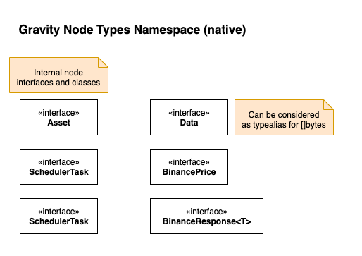
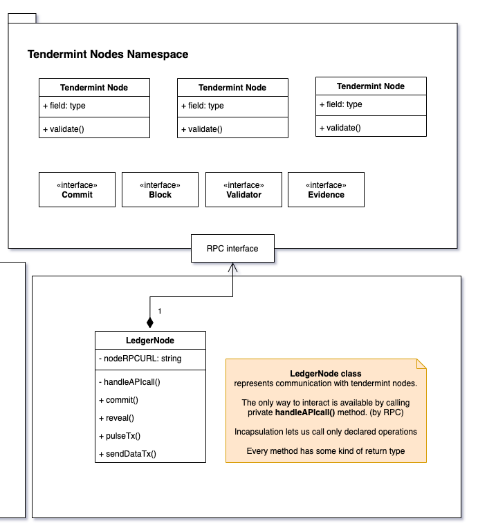
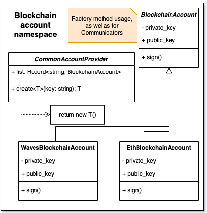
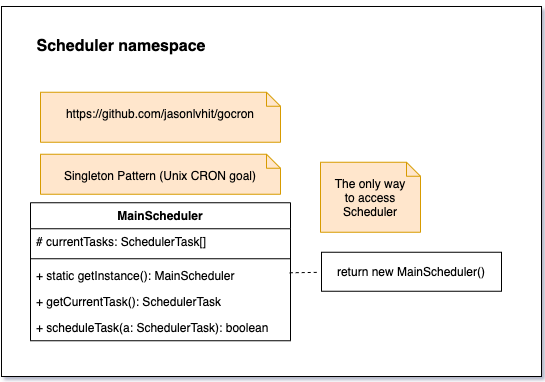
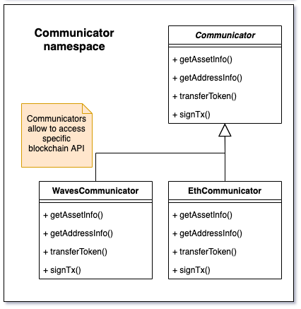
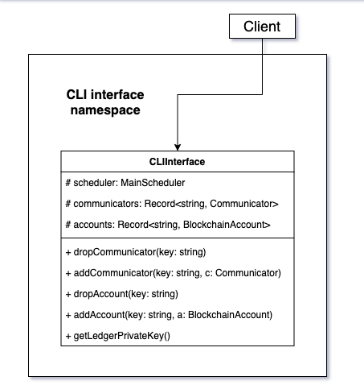
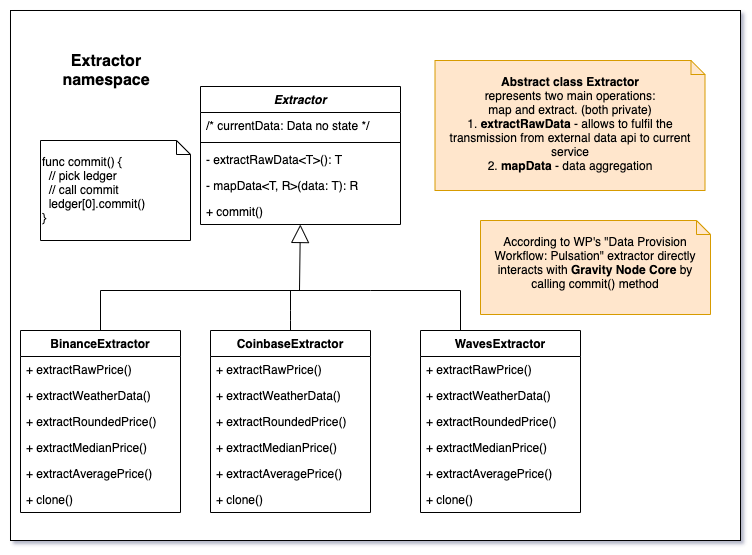

# Gravity Node Architecture

## Gravity node system types

The Types Namespace contains _global_ and _reusable_ interfaces/types that are used universally in the application. If a type does not conform to a specific client interface, _inheritance_ should be used. The most common types are listed below:

| Name | Description |
| :--- | :--- |
| **SchedulerTask** | represents task management entity for **MainScheduler** |
| **Asset** | common type for asset representation in a specific blockchain |
| **Account** | common type for account/address representation in a specific blockchain. Must have an address, private & public keys. |
| **Data** | `[]bytes` type alias |
| **Price** | common type for price data |
| **BinancePrice** | type \(price subtype\) that represents Binance price data |

## Tendermint node types

Tendermint offers BFT algorithm usage. Has its own API. We can communicate with its nodes by RPC protocol. Has its own system types. \(**Commit**, **Block**, **Validator**, **Evidence**\)

Models reference:

[Swagger UI](https://docs.tendermint.com/master/rpc/)

## Blockchain accounts

Namespace for account management \(store, delete, update\) for distinct chain. Must conform to **Account** type by design. Communication is provided using _Factory Method_ design pattern.

In a nutshell, distinct account creation is made by calling separate method.

Dictionary contains available list of concrete blockchain accounts for instantiation.

## Schedulers

Controller for task management. By design GH node needs only one task scheduler: **MainScheduler**. Basic FIFO allows for submission & execution of sequential tasks.

Methods reference:

1. getInstance - allows to access reference to global MainScheduler instance
2. getCurrentTask - returns current task
3. scheduleTask - adds task to queue, returns the result \(either added successfuly or not\)

The usability is provided by the usage of a _Singleton pattern_.

## Ledger nodes \(Core\)

Ledger node can be considered as wrapper of _Tendermint_. That is why ledger node connection to tendermint API is _composed of_  of _tendermint_ because it cannot exist without it or  that ledger node is _tightly coupled_.

Ledger node declares methods that allow GH node to communicate with each other for different purposes: 1. Reaching consensus 2. Gravity score 3. Validation of data

## Communicators

Allow to communicate with specific chains. The most important

The usage must provided by _Bridge pattern_ due to existence specific environment in most chains. **Ethereum** has several network with different conditions. However, the API is still the same. Such behaviour is suitable for _Bridge pattern_. We are not tight for a specific implementation. Distinction of interfaces provide ease of expanding.

## CLI interface

CLI interface provides access to methods available for client:

1. Node, height monitoring. 
2. Specific chain info. 
3. Current scheduler tasks.
4. Available & connected communicators.
5. Available & connected extractors.

## Extractors

Extractors operate by **Bridge pattern**. The problem is exactly similar to communicator's entity. However, if there was a chain requirement, _the extractor interface is solely declared by GH node_. It helps to distinct specific data extractors.

